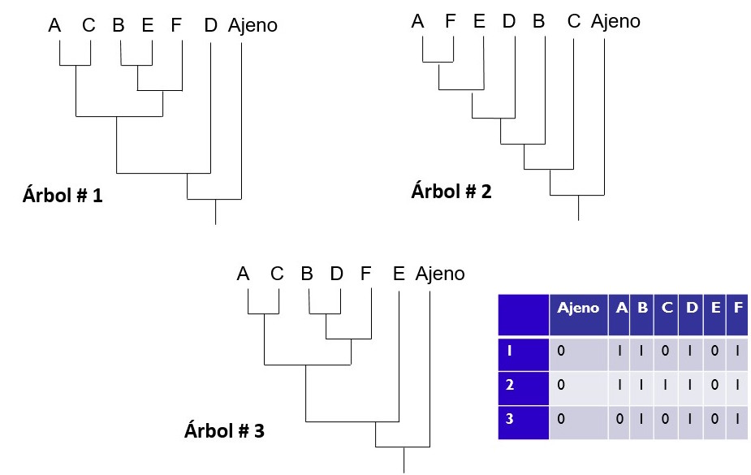
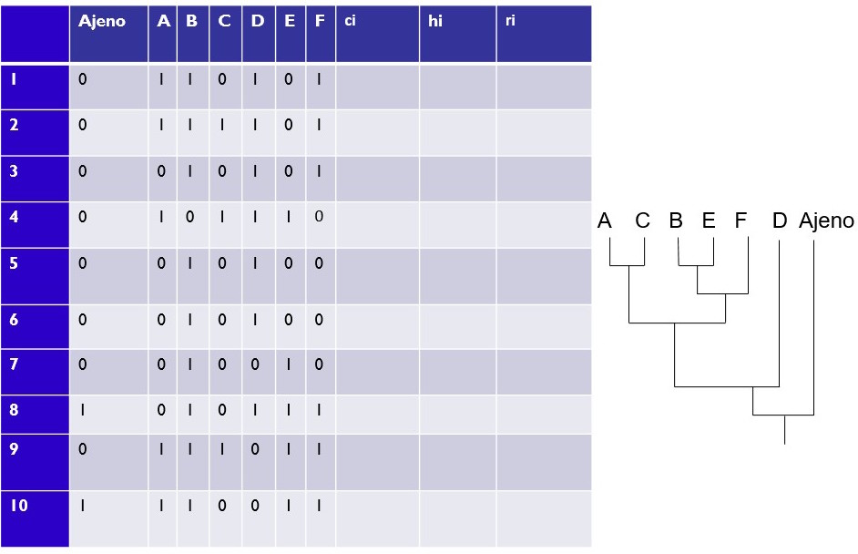
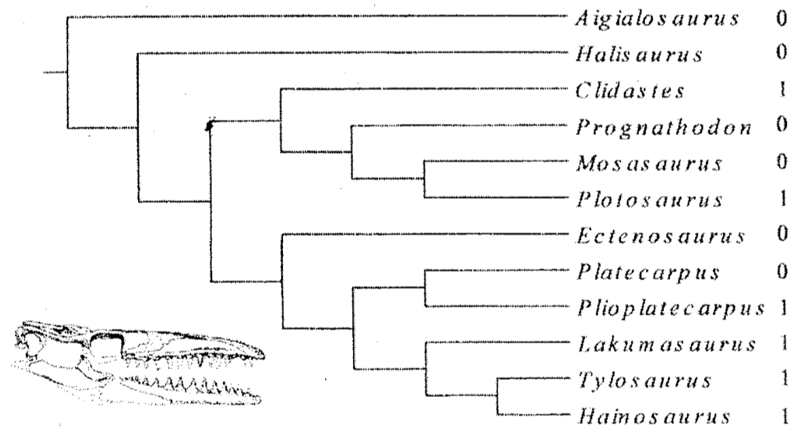
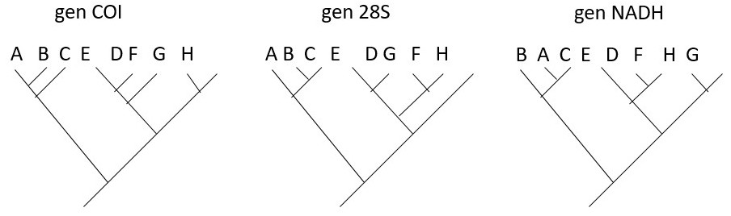

# TALLER MÁXIMA PARSIMONIA I: Optimización de caracteres

## Polarización a posteriori y longitud del árbol

Suponga que el siguiente es el mejor árbol filogenético de las relaciones evolutivas de los tetrápodos:

Este árbol fue inferido con base en la siguiente matriz de secuencias de ADN:

|Taxón|1|2|3|4|5|6|7|8|9|10|10a|10b|11|12|13|14|15|16|17|18|19|20|
|---|---|---|---|---|---|---|---|---|---|---|---|---|---|---|---|---|---|---|---|---|---|---|
|Salamandra|G|T|A|A|C|G|A|T|A|T|A|G|A|G|C|C|C|T|A|G|A|T|
|Rana|G|A|A|A|C|G|A|T|A|T|A|G|A|G|C|C|C|T|A|G|A|T|
|Serpiente|G|T|A|A|G|G|A|T|A|T|-|-|A|G|C|C|C|T|A|G|G|T|
|Ave|G|C|A|A|G|G|A|T|A|T|-|-|A|G|C|C|C|C|A|G|A|T|
|Humano|G|T|A|T|G|G|A|T|A|T|-|-|A|G|-|-|-|C|A|G|A|T|

Usando esta matriz y el árbol: 

1. Optimice los caracteres informativos en árbol usando el criterio de polarización _a posteriori_ y tomando en cuenta que todos los caracteres son no ordenados, tienen pesos iguales y son completamente independientes.

2. Calcule la longitud del árbol usando el criterio de la Máxima Parsimonia.

## Búsqueda del mejor (o mejores) árbol(es). 

Considere las tres hipótesis filogenéticas y la matriz de caracteres de la siguiente figura:

Con base en esta información:

1. Optimice los caracteres en cada hipótesis filogenética.

2. Calcule la longitud de árbol de cada hipótesis filogenética.

3. Indique cual es la hipótesis filogenética más parsimoniosa.

## Índices de homoplasia relativa

Con base en el árbol filogenético y matriz de caracteres de la siguiente figura:

1. Optimice los caracteres en el árbol.

2. Calcule la longitud del árbol.

3. Calcule los índices de consistencia (ci), índice de homoplasia (hi) e índice de retención (ri) de cada caracter.

4. Calcule los índices de consistencia (CI), índice de homoplasia (HI) e índice de retención (RI) del árbol.

## Optimización ACCTRAN y DELTRAN

Con base al siguiente árbol y el caracter ilustrado en la siguiente figura:

1. Optimice el caracter usando la optmización ACCTRAN y estime el número de pasos del caracter.

2. Optimice el caracter usando la optmización DELTRAN y estime el número de pasos del caracter.

## Árboles de consenso

Los tres árboles de la siguiente figura son los más parsimoniosos de tres análisis de Máxima Parsimonia realizados independientemente a partir de matrices de los marcadores de ADN: COI, 28S y NADH.

Con base en este resultado:

1. Dibuje el árbol de consenso estricto que resuma los tres resultados.

2. Dibuje el árbol de consenso de 50% de mayoría que resuma los tres resultados.
